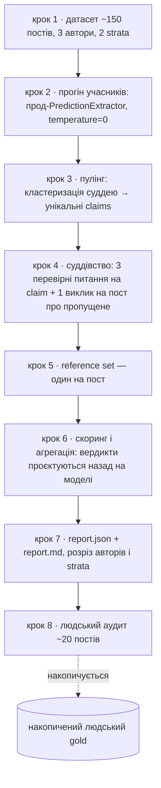
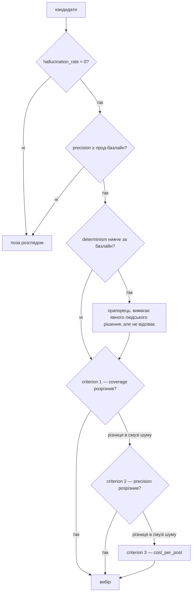

# Extraction Eval v2 — Design

**Дата:** 2026-07-25 (форма переписана 2026-07-29 під rung-anatomy; рішення не змінені. 2026-08-06 —
механізм дедуплікації змінено: поріг схожості прибрано, дедуплікацію робить суддя кластеризацією;
метрику `prediction_date_drift` знято з набору)
**Status:** 📋 designed — pre-implementation
**Рунг:** design (верхній над планом). Rung count = 2 — `design → plan`, дефолт, ladder-маніфесту немає.
**Контур:** новий консумер каркаса [`eval_common`](../eval-framework/2026-06-25-eval-pipeline-design.md); замінює
[extraction-quality eval v1](../extraction-quality-eval/2026-04-21-extraction-quality-eval-design.md) (Task 13.5).

---

## Altitude contract

| | |
|---|---|
| **Що цей рунг вирішує (рівно одне)** | **Методику вимірювання якості екстракції**: з яких даних знімається число, як побудоване суддівство, який набір метрик і які в них ролі, за яким правилом із цих чисел випадає вибір моделі. |
| **Що явно нижче — паркується в план** | Код і тіла функцій, тестовий код, точні команди й послідовність комітів, значення порогів, які знімаються з першого прогону, формат серіалізації звіту. |
| **Що вище й закрите — не переобговорюється** | **Контракт екстракції**: що вважається передбаченням і як воно має бути сформульоване — `EXTRACTION_SYSTEM` (`llm/prompts.py`) + [`annotation-guidelines.md`](../annotation/annotation-guidelines.md). **Каркас `eval_common`** — ролі, протоколи, `run_cases`, фейки. Евал міряє модель проти **чинної** рубрики й не заводить власної. |

**Altitude-тест цього рунга.** Візьми питання, назви дві правдоподібні відповіді, підстав кожну в речення
«методика вимірювання якості екстракції — це …». Якщо методика виходить та сама — питання нижче.

Прогін на прикладі: «токени для `cost_per_post` беремо з `LLMClient` чи з відповіді провайдера?» За обох
методика та сама: ціна на пост у ролі `criterion` 3. → нижче, паркується. А от «чи дедуплікуємо
claims перед суддівством узагалі» за двох відповідей дає дві різні методики → цей рунг, вирішено нижче.

---

## Глосарій — delta

Канонічний глосарій — [`docs/glossary.md`, §4](../glossary.md) (плюс §0 про перевантажені слова).
`gate`, `criterion`, `diagnostic`, `reference set`, `grounding`, `coverage` вживаються
**рівно так, як записано там**, англійською, і тут не перевизначаються.

Цей документ коїть три терміни понад §4:

**`stratum`** — поле запису датасету зі значеннями `"prefilter" | "random"`: як саме пост потрапив у вибірку.
Не жанр і не тема — лише спосіб відбору.

**`MetricSpec`** — структура, якою метрика оголошує свої здатності (`gate`, `criterion_priority`).
Носій класифікації з §4, живе в консумері.

**anchored-аудит** — режим людської перевірки, коли людина дивиться пост **разом із вердиктами судді**.
Термін потрібен, бо саме anchoring робить одну половину аудиту неспроможною (див. «Людський аудит»).

«Учасник» — звичайне слово прози на позначення моделі-кандидата, чиї claims ідуть у пул; окремим терміном
не заводиться.

---

## Inherited queue

Маніфесту немає — при rung count = 2 запарковані рядки нікуди не збиралися. Натомість цей рунг успадкував
два відкриті чіпи; обидва описані в `progress.md`, тут вони не переказуються.

| # | Питання | Звідки | Що робить цей рунг | Стан |
|---|---|---|---|---|
| I1 | Прибрати `prediction_date` з екстракції, завжди виставляти `published_date` | чіп `task_95a2d0be` | **Переадресовано цілком.** Рунг не вирішує долю поля й нічого туди не постачає: метрика `prediction_date_drift` знята з набору (див. «Реверсовані рішення»). Чіп лишається зі своєю проксі-оцінкою «1 інверсія на 95» ⚠️ і сам вирішує, чим її замінити. | 📌 → `task_95a2d0be` |
| I2 | Доля `target_date` — чи взагалі просити це поле | чіп `task_c8d43374` | **Частково закрито тут, решта переадресована.** Закрито: `target_date_recall` **не входить** у набір метрик v2 — вимірювати поле, доля якого відкрита, означає зафіксувати його існування побічним ефектом евалу. Не тут: чи просити поле взагалі. | ✅ метрика знята / 📌 поле → `task_c8d43374` |

Жоден із рядків не мовчить: I1 виходить із рунга з явною адресою, I2 — з одним закритим рішенням і однією
адресою.

---

## Навіщо v2

v1 відповів на питання «чи коректно витягнутий claim» і на його підставі обрано прод-модель. Відтоді
відкрилось три речі, які не лікуються правкою старого скрипта.

**Знаменник гуляв.** ✅ Суддя рахував пропущені передбачення **окремо для кожної моделі**, тож на тих самих
97 постах неявна «кількість передбачень у корпусі» виходила різною: Pro Preview 15 валідних + 36 missed =
51, Flash Lite 18 + 33 = 51, DeepSeek 28 + 20 = 48, Sonnet 3 + 44 = 47 (джерело: прогін v1,
`scripts/outputs/` + `progress.md`). Порівнювати покриття моделей проти знаменника, що залежить від моделі,
не можна — це чотири різні шкали під одним ім'ям.

**Та сама фраза діставала протилежні вердикти.** ✅ У пості `O_Arestovich_official_7683` фраза «С высокой
вероятностью будут всплывать всё новые скандалы и факты коррупции» отримала `faithful_paraphrase` у
Flash Lite і `not_a_prediction` у DeepSeek. Ідентичний текст, той самий суддя, той самий пост. Причина
механічна: суддя дивився різні набори claims і калібрувався об сусідів по набору. Те саме сталося з
«Электроэнергия будет отсутствовать часами и днями» — валідне у Pro Preview і Flash Lite, `not_a_prediction`
у DeepSeek.

**97 постів контаміновані.** На них ганявся detection-eval, на них тюнився `EXTRACTION_SYSTEM` v2, на них
обиралась прод-модель. Міряти прод-промпт на постах, проти яких його доводили, — train-on-test.

Плюс обставина, що не є дефектом v1: він писався у квітні 2026, каркас `eval_common` з'явився в червні.
Тому v2 — **новий консумер каркаса**, а не патч `scripts/extraction/extraction_quality_eval.py`. Старий
скрипт лишається як є; його результати цитуються як історія.

## Що v2 дає

Число, за яким можна обрати екстракційну модель і бути готовим захистити вибір: одна шкала покриття на
пост, спільна для всіх учасників; вердикт на унікальний claim, а не на пару модель×claim; явні ролі метрик,
тож «моделі приблизно однакові» перестає бути приводом обрати улюблену.

## Що вважається успіхом рунга

Прогін дає впорядкований список кандидатів, у якому кожну позицію можна пояснити конкретним числом і
конкретною роллю цього числа, а не «на око краще». Якщо після прогону вибір усе ще спирається на смак —
методика не спрацювала.

## Що лишається незмінним

**Контракт екстракції не рухається** — див. altitude contract, рядок «вище й закрите». Інакше евал каратиме
модель за те, що вона слухалась промпта, і «евал каже добре» розійшлося б із прод-поведінкою — рівно те, від
чого захищає правило `CLAUDE.md` «share prod code, don't fork it».

**Датасет — eval-артефакт, не прод-інжест.** Пости трьох авторів складаються у файл під `scripts/data/`,
а не в прод-БД. Евал не має права тягнути за собою розширення продукту; інжест нових авторів — окремий
трек з власним рішенням.

---

## Наскрізна послідовність прогону

Єдина нумерація документа. Внутрішні кроки компонентів нижче мають імена, не номери.



Кроки 3–5 строго після **повного** кроку 2: пулінг неможливий, поки не відпрацювали всі учасники. Це
відрізняє v2 від v1, де кожну модель можна було судити незалежно й потоково.

---

## Крок 0 — передумова, що блокує трек

**Рішення:** трек не стартує, поки Telegram-сесію не відновлено вручну; це крок плану, не примітка.

**depends on:** «Датасет» → рішення про свіжий пул.

**Чому.** ✅ Telethon-ключ мертвий: той самий auth-key жив одночасно на AWS-боксі й локально, Telegram убив
його безповоротно (`AuthKeyDuplicatedError`, `progress.md` за 2026-07-12). Без живої сесії нових постів не
зібрати, а весь трек стоїть на свіжому пулі. Мітигація проти рецидиву вже в коді
(`telegram_source_enabled=false` локально) ✅, але сам ключ вона не воскрешає.

**Відкинуті альтернативи.** Взяти пости з публічного `t.me/s/` замість Telethon — відкинуто: цим зондом
знімалася лише статистика довжин для вибору авторів, він не дає стабільного id поста й дати публікації, на
які спирається запис датасету.

---

## Датасет (крок 1)

### Навіщо свіжий пул

97 постів v1 виключаються цілком і явно. Не тому, що вони погані, а тому що на них уже приймали рішення:
проти них доводився промпт і обиралась модель. Будь-яке число, зняте на них, вимірює підгонку, а не якість.

### Що дає

~150 постів трьох авторів, кожен із яких навантажує окрему зону, де моделі й судді v1 розходились.

| Автор | Канал | ~Постів | Навіщо саме він |
|---|---|---:|---|
| Арестович | `@O_Arestovich_official` | ~70 | прод-корпус; за ним ухвалюється рішення |
| Машовець | `@zvizdecmanhustu` | ~40 | текст насичений констатацією теперішнього — переміщення частин, склад угруповань → прицільний стрес-тест на over-extraction |
| Кущ | `@Analityka_Kush` | ~40 | багато умовних прогнозів «если это произойдет, то…» → друга задокументована зона розбіжностей суддів |

**depends on:** «Навіщо v2» → обидві задокументовані хвороби v1.

**Чому саме ці троє.** Вибір не інтуїтивний, а проти двох конкретних провалів v1. ✅ На констатації
теперішнього сипався DeepSeek — він видавав «противник УЖЕ начал снимать с фронта» як передбачення. ✅ На
умовних конструкціях судді v1 розходились самі з собою: та сама умовна фраза про корупцію в обороні один раз
названа missed, другий раз `not_a_prediction`.

Кандидатів зважено зондом публічного `t.me/s/` ✅: Машовець — медіана 274 слова, 69% постів довші за 150 слів,
3% YouTube-анонсів, 3% репостів; Кущ — медіана 160 слів, 53% довших за 150.

**Відкинуті альтернативи.**

- **Портников як третій автор** — медіана 7 слів, 100% постів це анонси YouTube-ефірів ✅. Екстрагувати нема
  з чого: датасет із таких постів міряв би не екстракцію, а поведінку на порожньому вході.
- **Флеш (`@serhii_flash`) як україномовна вісь** — медіана 61 слово, майже без прогнозів: пояснює будову
  ворожої техніки ✅. Обмін «мова замість прогнозів» відхилено — датасет із текстів без передбачень не міряє
  екстракцію передбачень, якою б мовою він не був. Наслідок фіксується як обмеження: **про поведінку
  екстрактора українською цей евал не говорить нічого**, і мова свідомо не є віссю вимірювання.

### Як влаштований відбір

~70% постів проходять через префільтр-детектор (Flash Lite, переможець Task 13), ~30% беруться випадково
без жодного фільтра. Кожен запис несе `stratum`.

**Чому випадкова частина.** Не для повноти, а проти сліпої зони: без неї датасет перекошений у бік того, що
детектор і так уміє бачити, і покриття міряється лише там, де детектор уже спрацював. `stratum` дозволяє
подати обидва числа окремо й побачити, чи модель знаходить щось поза детекторським полем зору.

**Відкинута альтернатива:** 100% через префільтр — дешевше й дає щільніший на прогнози корпус, але робить
сліпу зону детектора невимірною за побудовою.

### Форма артефакту

`scripts/data/extraction/eval_dataset_YYYY-MM-DD.json` — датований суфікс за конвенцією `CLAUDE.md`
(версіонування знімками, споживач посилається на явний датований шлях, без авто-«latest»).

```jsonc
// TO-BE — форма запису; побудова артефакту реалізується за планом
{
  "metadata": {
    "collected_at": "YYYY-MM-DD",
    "channels": ["..."],
    "selection_method": "prefilter+random",
    "prefilter_model": "...",
    "distribution": { "by_author": {}, "by_stratum": {} },
    "excluded_v1_ids": ["... 97 контамінованих id ..."]
  },
  "posts": [
    { "id": "", "author": "", "channel": "", "text": "",
      "published_date": "", "stratum": "prefilter | random", "url": "" }
  ]
}
```

Виключення 97 id записується **в сам артефакт**, а не лише в цей документ: інакше через півроку хтось додасть
пости «для обсягу» й тихо поверне контамінацію.

### Реверсоване рішення — dev/test спліт

**Рішення:** спліту немає. Робочий пул хай контамінується ітераціями; коли потрібне число для рішення —
береться свіжа вибірка з корпусу. Як held-out бережеться лише накопичений з аудитів людський gold (крок 8).

**Чому.** Held-out існує тому, що розмітка дорога — тримати частину даних недоторканою має сенс, коли новий
чесний зріз коштує людських днів. Тут розмітку робить суддя, тож свіжий зріз коштує лише токенів, а 5572
пости Арестовича вистачить надовго ✅. Ділити пул — платити половиною даних за те, що й так доступне.

⚠️ **Assumption, не перевірено.** Аргумент тримається на тому, що пересемплювання нічого не псує. Це вірно,
поки суддя не змінюється між прогонами. Якщо суддівський промпт правитиметься **після** пілотного прогону —
а він, найімовірніше, правитиметься, бо два пороги знімаються саме з першого прогону — то другий прогін
поїде і по новому судді, і по новій вибірці. Тоді покращення числа не розділити: «полагодили суддю» чи
«трапилась легша вибірка». Для одного конкретного рішення вибірку варто заморозити, і «дешево пересемплити»
цього не замінює. **Рішення лишається як є**; ризик названий і не мітигований.

### Що може піти не так

Три автори — три різні жанри, і при ~40 постах на автора числа орієнтовні ⚠️. Це не привід не рахувати, це
привід не подавати їх як точний вимір (див. «Наскрізні правила»).

---

## Прогін учасників (крок 2)

**Рішення:** кожен кандидат ганяє **прод**-`PredictionExtractor.extract()` з чинним `EXTRACTION_SYSTEM`,
`temperature=0`. Жодного eval-специфічного промпта.

**depends on:** altitude contract → «контракт екстракції вище й закритий».

**Чому.** Інакше «евал каже добре» розійдеться з прод-поведінкою — те саме правило «share prod code».

**Як лягає на каркас.** `EvalCase.input` — пост (текст, дата публікації, автор, канал, `stratum`),
`labels=None`. Розмітки немає за побудовою: усі метрики v2 reference-free відносно людського еталона, і
`eval_common` явно дозволяє case без `labels` ✅. Один прохід `run_cases` на модель дає `list[EvalRun]`;
`result` — список витягнутих `Prediction`, `None` якщо модель впала на цьому пості.

**Учасники — відкрите (→ план).** Обов'язково прод-Flash Lite як базлайн — без нього немає відносного порогу
`precision`. Плюс 3–4 нових кандидати. З цього списку випливає вибір судді.

**Перший прогін по підвибірці ~20 постів зберігається окремо** — він же перший із двох прогонів для
`determinism`.

---

## Конструкція суддівства (кроки 3–5) — головний фікс v2

### Навіщо

Обидві хвороби v1 — плаваючий знаменник і протилежні вердикти на ідентичному тексті — мають один корінь:
одиницею суддівства була пара **модель×пост**. Суддя бачив набір claims однієї моделі й калібрувався об
нього.

### Що дає

**Рішення:** дедуплікація claims **перед** суддівством, один вердикт на унікальний claim.

**depends on:** «Навіщо v2» → обидві хвороби; `glossary.md` §4 → `reference set`.

**Чому.** Три речі одразу. Та сама фраза не може отримати два вердикти — фізично, бо вердикт один.
Порівняння моделей стає чесним за побудовою, а не за старанністю судді. І платимо за унікальні claims замість
модель×claim — при 4 учасниках, що часто цитують той самий рядок, це помітно.

**Відкинута альтернатива:** лишити суддівство пер-модель і просто зафіксувати спільний знаменник окремим
викликом. Відкинуто — це лікує знаменник, але не лікує протилежні вердикти на ідентичному тексті: суддя й далі
калібрувався б об набір однієї моделі.

### Як влаштовано

**Пулінг.** Claims усіх учасників по одному посту зводяться в множину унікальних. Порога схожості немає:
дедуплікацію робить суддя одним викликом на пост — «згрупуй claims, які говорять те саме». У коді лишається
тільки безкоштовний пре-прохід: точна рівність після нормалізації (пробіли, регістр, пунктуація). Це не
порівняння схожості, а рівність рядків; воно лише зменшує вхід кластеризації.

**Чому не поріг схожості.** Лексична міра програє з двох боків одразу. «Ціни зростуть» і «Ціни не зростуть»
дають token-Jaccard 0.67 і `SequenceMatcher` 0.90 — заперечення майже не рухає число, тож високий поріг
склеїв би протилежні claims мовчки. З іншого боку, те саме передбачення можна переказати словами з низькою
схожістю, і воно лишилось би двома claims. Ембединги не рятують: заперечення вони кладуть поруч так само.
Одним порогом ці два випадки не розводяться в принципі, тому механізм прибрано, а не підкручено.

Ціна кластеризації — один виклик на пост. Попарна ескалація при 4 учасниках коштувала б на порядки більше
питань, тож дешевший варіант тут і є правильнішим.

**Питання до судді — лише обмежені перевірні.** Три на унікальний claim:

- `grounding` для `claim_text` — чи твердження простежується до тексту поста;
- `grounding` для `situation` — те саме для парафразного поля; дослівного збігу не буде за побудовою, тому
  питання саме про `grounding`, а не про збіг;
- відповідність чинній рубриці — чи це передбачення за `EXTRACTION_SYSTEM` + annotation-guidelines.

Плюс **один виклик на пост** про пропущене: що в тексті є передбаченням, але не витягнув ніхто.

Кластеризація (крок 3) — третій вид виклику судді, теж один на пост. Вона не видає вердиктів і не бачить,
який claim від якої моделі, тож хвороба v1 через неї не повертається.

**Чому питання саме такі.** Кожне перевірне проти поданого тексту й має однозначну відповідь.
**Відкинута альтернатива — 6-значний ordinal-вердикт v1:** він змішував «чи є це в тексті» з «наскільки добре
сформульовано», і саме на змішаному питанні судді розходились між собою ✅.

**`reference set` будується раз на пост:** унікальні валідні claims усіх учасників **плюс** пропущене,
назване суддею. Усі моделі міряються об цю одну множину — це і є фікс плаваючого знаменника.

**Валідний claim** = має `grounding` в обох полях + проходить рубрику + не обрізаний.

**Суддя — з іншої родини, ніж будь-хто з учасників.** ✅ У v1 Sonnet був учасником при судді Opus — одна
родина, і це чесно позначено там як обмеження. Оскільки список учасників відкритий, відкритий і суддя;
фіксоване тут — саме обмеження, не конкретна модель.

### Що може піти не так

**Reference set — нижня межа, і це системно.** Передбачення, яке проґавили всі учасники й не помітив суддя,
у множину не потрапляє. Отже абсолютне значення `coverage` оптимістичне, а порівняння моделей — коректне.
Прямий наслідок для ролі метрики: `coverage` може впорядковувати, але не відсікати.

**Стабільність кластерів — тепер властивість LLM, а не коду.** Поріг був детермінований, кластеризація суддею
— ні. Мітигація: `temperature=0`, стабільний (відсортований) порядок claims на вході, збереження результату
кластеризації на диск як проміжного артефакту — перезапуск суддівства не перекластеризовує. Сама помилка
кластеризації симетрична: вона однаково змінює `reference set` для всіх учасників, тож порівняння моделей
лишається чесним, а `coverage` і без того нижня межа.

---

## Метрики (крок 6)

### Навіщо ролі

Набір метрик без явних ролей читається як список рівноправних чисел, і людина щоразу наново вирішує, які з
них щось вирішують. Тоді «моделі однакові» стає приводом обрати улюблену.

**Рішення:** метрика оголошує **дві незалежні здатності**, а не одну роль — може мати обидві, одну або жодної.

**depends on:** `glossary.md` §4 «Класифікація метрик за роллю в рішенні» — визначення термінів там, тут не
повторюються.

```python
# TO-BE — інтерфейс; тіла й серіалізація за планом
class MetricSpec:
    name: str
    gate: GateSpec | None            # поріг + blocking
    criterion_priority: int | None   # None = не впорядковує
```

Обидві `None` означає, що метрика не відсікає й не впорядковує: у наборі v2 це `diagnostic`
(`over_extraction_rate`) — число для людини, яка читає звіт, а не для правила вибору.

### Набір

| Метрика                 | `gate`                   | `criterion`     | Формула                                                                          | Хто рахує |
| ----------------------- | ------------------------ | --------------- | -------------------------------------------------------------------------------- | --------- |
| `hallucination_rate`    | blocking, ≈0             | —               | claims без `grounding` хоч в одному з двох полів / усі витягнуті                 | суддя     |
| `precision`             | blocking, ≥ прод-базлайн | 2               | валідні / усі витягнуті                                                          | суддя     |
| `determinism`           | non-blocking             | —               | пости з ідентичним виходом на 2 прогонах / ~20                                   | код       |
| `coverage`              | —                        | 1               | \|знайдені ∩ `reference set`\| / \|`reference set`\|                             | суддя     |
| `cost_per_post`         | —                        | 3               | токени × прайс / пости                                                           | код       |
| `over_extraction_rate`  | —                        | `diagnostic`    | claims, наявні в тексті поста, але такі, що не проходять рубрику / усі витягнуті | суддя     |

### Правило вибору



Кожен наступний `criterion` консультується **лише** якщо попередній не розрізнив, тобто різниця лягла в смугу
шуму вимірювання. Числове значення смуги — нижче (→ план), знімається з першого прогону.

⚠️ **Assumption щодо смуги.** Повторний прогін дає нестабільність **інструмента** — того самого коду на тих
самих постах. Це не те саме, що дисперсія від **вибору** ~150 постів із 5572: різниця між двома моделями може
впевнено перевищувати шум інструмента й водночас цілком поміщатися в розкид, який дала б інша вибірка постів.
Дві різні величини, і смуга, знята повторним прогоном, накриває лише першу. Друга не міряється цим евалом.

### Принцип, з якого це виводиться

**`gate` потребує достовірного абсолютного значення; `criterion` обходиться порівнюваністю.** Метрика, чий
абсолют не заслуговує довіри, може впорядковувати, але не може відсікати — хіба що поріг сформульовано
**відносно базлайну**.

Звідси дві конкретні речі в таблиці. `coverage` — `criterion`, бо `reference set` м'який і систематично
занижений; порівнювати ним можна, різати по ньому не можна. А `gate` по `precision` заданий як «не гірше за
поточний прод», а не абсолютним числом, бо абсолютна точність залежить від строгості судді, яка сама не
відкалібрована ⚠️.

### `gate` по `precision` — антигеймінг, не стандарт якості

Записано прямо, бо інакше наступна людина підніме поріг «щоб було якісніше» і зламає вибір.

Він існує рівно проти одного: без нього `coverage` тривіально накручується розкидуванням. ✅ У v1 DeepSeek дав
найбільше покриття (0.58 при знаменнику ~48) і найгіршу точність (0.44) — суддя забракував 36 із 64 claims.
Модель, що вивалює все підряд, виграє покриття за побудовою.

Поріг має бути достатньо **низьким**, щоб пропускати легітимні обміни. ✅ Flash Lite у v1 має precision 0.51
проти 0.65 у Pro Preview — і все одно кращий вибір за сукупністю. Поріг, підкручений «щоб було якісніше»,
викинув би саме прод-модель.

### Чому `coverage` вище за `precision` — ціннісний вибір, не математика

Пропущене передбачення означає, що продукт недодав: його немає в БД, воно не знайдеться в пошуку, його ніколи
не верифікують. Зайве здебільшого поглинеться верифікатором як `unresolved` — ✅ на прод-корпусі це вже 46%
вердиктів, тобто механізм працює.

Це продуктова політика, а не властивість даних. Записано з причиною, щоб хтось не поміняв порядок, не
помітивши, що міняє політику.

### `determinism`

Підвибірка ~20 постів, фіксована й спільна для всіх моделей, два прогони, `temperature=0`. Порівняння —
**нормалізована структура**: список claims, поля зі знятими крайніми пробілами, порядок враховується.
Не побайтово: різниця у форматуванні JSON не є недетермінізмом моделі. Перший прогін — основний прогін евалу,
доплата лише за другий.

**Чому взагалі `gate`.** Недетермінізм ламає не поточний замір, а **всі майбутні**. ✅ Увесь тюнінг промпта в
проєкті тримається на тому, що Flash Lite при `temperature=0` відтворюваний — окремий інсайт Task 19.9.
Модель, що дає різний вихід на тому самому вході, робить кожну наступну зміну промпта неперевірною.

**Чому `non-blocking`.** Помітно кращого за іншими осями кандидата можна прийняти свідомо, з відкритими очима.
Але не мовчки — прапорець вимагає явного людського рішення.

### Де живе класифікація

**У консумері, не в `eval_common`.** Каркас про ролі метрик нічого не знає й не має знати: консумер поки один,
узагальнювати рано (правило трьох із `CLAUDE.md`). **Відкинута альтернатива** — одразу підняти `MetricSpec` у
каркас: дешевше зараз, але зафіксувало б у спільному коді абстракцію, перевірену одним споживачем. Якщо третій
трек попросить те саме — тоді переносити.

---

## Наскрізні правила

**Усереднення — macro по постах.** Пост, а не claim, — одиниця, на якій моделі порівнюються; micro дало б вагу
постам, де хтось вивалив десяток claims.

**Пости з нулем витягнутих claims** виключаються з `precision`, `hallucination_rate`, `over_extraction_rate`
(ділити нема на що), але **лишаються** в `coverage`. Мовчання — це провал покриття, а не ідеальна точність.
Асиметрія навмисна; без неї модель, що мовчить, виглядала б бездоганною.

**Кожна метрика подається в розрізі авторів і strata**, спільних середніх не публікуємо. При ~40 постах на
автора числа орієнтовні — це сказано в звіті прямо, а не мається на увазі.

**Усі вердикти — в `ScoreCard.detail`**: маркер, id, речення, вердикт, причина. ✅ Урок citation-прогону
записаний у `progress.md`: картка без `detail` зробила перший результат недіагностовним, і причину провалу
довелось шукати навпомацки.

**Термінологія:** `coverage`, не `recall`; `reference set`, не «gold». Обидва рішення вже зафіксовані в
[`glossary.md`](../glossary.md) §0 і §4 наперед і тут не переказуються.

---

## Людський аудит (крок 8)

### Навіщо, якщо суддя — AI

Замороженого людського еталона немає: генерацію кандидатів і суддівство робить AI. Це свідоме рішення
користувача проти 100+ постів ручної розмітки. Аудит — не заміна еталона, а вибіркова перевірка, чи суддя
взагалі в притомному діапазоні.

### Що дає

**Рішення:** ~20 постів **абсолютним числом**, не відсотком від датасету. Склад — 2/3 випадкових + 1/3
таргетованих (пости, де моделі розійшлись).

**depends on:** «Датасет» → рішення тримати held-out лише у вигляді накопиченого людського gold.

**Чому абсолютне число.** 10–20% від 150 було б забагато ручної роботи, а головне — при відсотку датасет не
можна нарощувати без росту ручної праці. Абсолютне число розриває цей зв'язок.

**Чому змішаний склад.** Випадкові дають частоту помилок, яку можна переносити на корпус; таргетовані ловлять
систематичні провали, але статистику по них переносити не можна. У звіті — **окремими числами, не спільним
середнім**: змішати їх означає отримати частоту помилок, завищену конструкцією вибірки.

Аудит-зріз **накопичується в людський gold**: кожен наступний прогін додає ~20 постів, за 3–4 ітерації
назбирується 40–60 без окремо витраченого дня. Тому кожен аудит зберігається з id постів і датою — інакше
зрізи не склеїти.

### Обмеження, яке треба записати прямо: аудит anchored

Користувач дивиться пости **разом із вердиктами судді** — свідоме рішення заради швидкості. Наслідок
несиметричний ⚠️:

- для **зайвого** claim якір майже нешкідливий: питання «чи є це в тексті і чи проходить рубрику» перевірне
  проти самого тексту;
- для **пропущеного** — суттєвий: бачачи готовий список, мозок перестає шукати те, чого в списку немає.

Тому число по пропущеному подається як **нижня межа**, і аудит **не є незалежною перевіркою** recall-половини.

**Відкинута альтернатива:** контрольний зріз із 5 сліпих постів — відхилено користувачем; обмеження
приймається як є, а не мітигується.

---

## Розкладка й межі консумера

Консумер приносить тільки своє; каркас лишається недоторканим. Модулі названі за ролями — розподіл коду по
них і самі тіла реалізуються за планом.

```text
TO-BE
scripts/extraction/build_eval_dataset.py     # крок 1, upstream, окремий запуск
scripts/extraction/eval_v2/
  dataset.py          # JSON → EvalCase[]
  pool.py             # нормалізація + збирання кластерів судді (крок 3)
  judge_prompts.py    # кластеризація, 3 питання на claim, missed-виклик
  scorers.py          # проєкція вердиктів на моделі
  metrics.py          # MetricSpec, Metrics-сабтайп, агрегація
  extraction_eval.py  # композиція роль-функцій

scripts/data/extraction/eval_dataset_YYYY-MM-DD.json
scripts/outputs/extraction_eval_v2/{report.json,report.md}
```

Підпакет, а не файли поруч: `scripts/extraction/judge_prompts.py` уже зайнято v1 ✅, і паралельні імена в
одному каталозі — найпростіший спосіб переплутати два евали.

**`run_eval()` не використовується.** Прогін багатостадійний — пулінг і суддівство є окремими стадіями між
Runner і Scorer, — тож консумер композує роль-функції напряму. Каркас це прямо дозволяє й називає
`extraction_quality` як приклад такого евалу ✅. Спільний `run_cases` обслуговує обидві осі фан-ауту: виклики
екстракторів і виклики судді.

**Проміжні артефакти зберігаються на диск** після кроків 2 і 3: підкрутив суддівський промпт — переганяєш лише
суддівство, не платиш ні за екстракцію, ні за кластеризацію вдруге. Це успадкований від v1 патерн, і тут він потрібен ще й тому, що
другий прогін для `determinism` має порівнюватись саме зі збереженим першим.

---

## Що може піти не так

| Ситуація | Правило |
|---|---|
| Telethon-сесія не відновлена | трек не стартує; це крок 0, не примітка |
| Екстрактор упав на пості | `EvalRun(result=None, error=<тип>)`, прогін триває — ізоляція Runner-а |
| Суддя віддав непарсибельний вихід | retry політикою `LLMClient`; вичерпано → вердикт-сентинел + лічильник у `metadata` |
| Виняток усередині scorer-а | ловиться на межі scorer-а, а не валить прогін — ✅ у citation-прогоні незловлений `JSONDecodeError` коштував увесь прогін на 81/92 (чіп `task_4fbc7122`) |
| Пост без жодного claim у всіх моделей і без missed | лишається в `coverage` зі знаменником 0 → метрика `None`, не `0.0` |
| `reference set` порожній на пості | `coverage = None` (не визначено), не `0.0` — за конвенцією detection-eval |

Логування — за правилами `CLAUDE.md`: прогрес кожні N, не per-item INFO; тексти постів, claims і суддівських
відповідей у лог не течуть.

---

## Чим покрито

Усе, що не торкається мережі, тестується напряму; усе, що торкається — через фейки каркаса (`FakeJudge`,
фейковий SUT). Жоден тест не ходить у мережу чи БД. Нижче — **поведінки**, які мають бути покриті; конкретні
тести й порядок їх написання — за планом.

- **Пулінг** — нормалізація, злиття точних дублікатів у коді, збирання кластерів судді в множину унікальних
  claims; поведінка, коли суддя повернув claim, якого не було на вході.
- **Побудова `reference set`** — об'єднання валідних claims із missed; поведінка на порожньому наборі.
- **Проєкція вердиктів на моделі** — той самий claim у двох моделях дає їм однаковий вердикт: прямий
  regression-тест на хворобу v1.
- **Агрегація** — macro по постах; виключення нульових постів із `precision` при збереженні їх у `coverage`;
  ділення на нуль → `None`.
- **Правило вибору** — на синтетичних `Metrics`: `gate` відсікає; `criterion` нижчого пріоритету
  консультується лише в межах смуги шуму; `non-blocking` gate дає прапорець, а не відсів.
- **Датасет-лоадер** — fail-loud на malformed записі, до будь-яких LLM-викликів.

Поведінкове підтвердження — сам перший прогін: він же дає числа для двох запаркованих порогів.

---

## Реверсовані рішення

| Рішення | Чому реверсовано |
|---|---|
| dev/test спліт датасету | Held-out існує, бо розмітка дорога. Розмітку робить суддя → свіжий зріз коштує лише токенів, а корпусу 5572 пости. Замість спліту — правило «число для рішення знімається на небачених постах». ⚠️ Ризик названий у секції «Датасет» |
| Портников як третій автор | Медіана 7 слів, 100% YouTube-анонсів — екстрагувати нема з чого |
| Флеш як україномовна вісь | Медіана 61 слово, майже без прогнозів. Обмін «мова замість прогнозів» не вартий того |
| Контрольний зріз із 5 сліпих постів в аудиті | Відхилено користувачем; anchored-обмеження приймається як є й записується явно |
| `target_date_recall` як метрика | Знято з набору (рядок I2); питання «чи взагалі просити поле» пішло чіпом `task_c8d43374` |
| `prediction_date_drift` як метрика | Знята з набору. Це не вимір якості екстракції: еталона для поля немає, метрика лише рахувала розбіжність із `published_date` заради чужого рішення. Постачання числа в чіп `task_95a2d0be` — не робота цього евалу; чіп бере число власним способом |
| Поріг схожості для дедуплікації claims (був P4) | Лексична міра програє з двох боків: заперечення майже не рухає число («Ціни не зростуть» → 0.90), а перефразування розводить той самий claim на два. Ембединги мають ту саму ваду на запереченні. Замість порога — кластеризація суддею одним викликом на пост; разом із порогом зникло й припущення про буквальні збіги |

---

## Parked / відкладено вниз

Цей рунг свідомо не закриває нічого з переліченого — усе це не змінює методику, лише її параметризує.

| # | Питання | → адресат | Чому не тут | Стан |
|---|---|---|---|---|
| P1 | Список моделей-учасниць (прод Flash Lite обов'язково як базлайн + 3–4 кандидати) і, як наслідок, конкретний суддя | → план | Методика однакова за будь-якого списку; фіксоване тут — обмеження «суддя з іншої родини», не імена | 📌 |
| P2 | Числове значення смуги шуму | → план (з першого прогону) | Порядок консультації criterion-ів не залежить від числа | 📌 |
| P3 | Конкретний поріг `precision` | → план (від базлайну в першому прогоні) | Форма порога («не гірше за прод») закрита тут, число — ні | 📌 |
| P4 | Звідки беруться токени для `cost_per_post` — з `LLMClient` чи з відповіді провайдера | → план | Каркас свідомо не має cost/token-трекінгу ✅ («не в v1»); метрика його потребує, але джерело числа не змінює її ролі | 📌 |
| P5 | Стратифікація підвибірки для `determinism` — випадково чи по авторах і strata | → план | `determinism` — non-blocking gate за будь-якого складу підвибірки | 📌 |
| P6 | Де зберігається накопичений аудит-gold і як склеюються зрізи різних прогонів | → план | Рішення «зберігати з id постів і датою» закрите тут; місце й формат — ні | 📌 |
| P7 | Доля `prediction_date` у контракті екстракції | → чіп `task_95a2d0be` | Це зміна прод-контракту, тобто рунга **вище** за цей; евал про це поле нічого не каже | 📌 |
| P8 | Доля `target_date` як поля | → чіп `task_c8d43374` | Те саме: прод-контракт вище | 📌 |

---

## Чого тут немає навмисно

**Вище цього рунга** — контракт екстракції: що вважається передбаченням, які поля має `Prediction`, як
формулюється `situation`. Живе в `EXTRACTION_SYSTEM` (`llm/prompts.py`) і
[`annotation-guidelines.md`](../annotation/annotation-guidelines.md). Цей документ їх не переказує й не
оскаржує; питання про поля пішли в P7/P8.

**Вище цього рунга** — каркас `eval_common`: ролі, протоколи, `run_cases`, фейки, дозвіл на `labels=None`.
Живе в [`eval-pipeline-design.md`](../eval-framework/2026-06-25-eval-pipeline-design.md). Тут — лише те, як
консумер на нього лягає.

**Вище цього рунга** — визначення `gate`/`criterion`/`diagnostic`/`reference set`/`grounding`/
`coverage`. Живуть у [`glossary.md`](../glossary.md) §4. Тут вони вживаються, а не визначаються; delta —
три терміни на початку документа.

**Нижче цього рунга** — весь код і тести: тіла функцій, точні сигнатури внутрішніх хелперів, послідовність
комітів, команди запуску, формат `report.md`, значення порогів P2–P3. Живе в plan-док цього ж каталогу
(ще не написаний).

**Історія, не рішення** — v1: [`extraction-quality-eval`](../extraction-quality-eval/2026-04-21-extraction-quality-eval-design.md).
Його числа цитуються як докази хвороб, його скрипт не патчиться.

---

## Звідки взяті факти

**Джерела.**

- Прогін extraction-quality eval v1 (квітень 2026): знаменники 47–51 на 97 постах, precision Flash Lite 0.51 /
  Pro Preview 0.65 / DeepSeek 0.44, coverage DeepSeek 0.58, вердикти на постах `O_Arestovich_official_7683` —
  вихідні артефакти під `scripts/outputs/` + записи в `progress.md`.
- `progress.md`: `AuthKeyDuplicatedError` 2026-07-12; урок citation-прогону про `ScoreCard.detail`; провал
  81/92 на `JSONDecodeError` (`task_4fbc7122`); опис чіпів `task_95a2d0be` і `task_c8d43374`; інсайт Task 19.9
  про відтворюваність Flash Lite при `temperature=0`; 46% `unresolved` на прод-корпусі.
- Зонд публічного `t.me/s/` (липень 2026): медіани довжин і частки анонсів для Машовця, Куща, Портникова,
  Флеша; 5572 пости в корпусі Арестовича.
- [`glossary.md`](../glossary.md) §0 і §4 — термінологія.
- [`eval-pipeline-design.md`](../eval-framework/2026-06-25-eval-pipeline-design.md) — можливості каркаса,
  включно з відсутністю cost/token-трекінгу.
- `CLAUDE.md` репозиторію — конвенція датованих файлів, «share prod code», правило трьох, логування.

**Що НЕ перевірено емпірично.**

- Жодне число v1 не переміряне під час цього рерайту: усі цифри перенесені з версії 2026-07-25 і з її джерел
  як є.
- ⚠️ Стабільність кластеризації claims суддею між прогонами не перевірена. Мітигації (`temperature=0`,
  сортований вхід, збережений артефакт кластеризації) прийняті на віру й не міряні.
- ⚠️ Припущення, що пересемплювання свіжої вибірки не псує порівнянність між прогонами (секція «Датасет»).
- ⚠️ Смуга шуму, знята повторним прогоном, накриває нестабільність інструмента, а не дисперсію від вибору
  ~150 постів із 5572. Друга величина цим евалом не міряється взагалі.
- ⚠️ Строгість судді не відкалібрована — саме тому `gate` по `precision` заданий відносно базлайну.
- ⚠️ При ~40 постах на автора числа в розрізі авторів орієнтовні; довірчих інтервалів евал не рахує.
- ❌ Гіпотеза «97 постів v1 можна доукомплектувати й перевикористати» — перевірена й відкинута: вони
  контаміновані трьома різними способами одночасно (detection-eval, тюнінг промпта, вибір моделі), тож
  жодна їх частина не є чистою.


# Відкриті питання
- [ ] Що таке "**Знаменник гуляв.**"? 