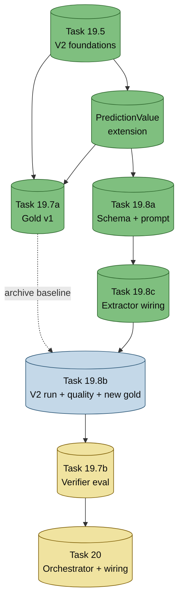

# Verifier-v2 — Project Status

**Last updated:** 2026-05-14
**You are here:** 🎯 19.8a/c/d LANDED (situation field, 154 tests) — далі re-run 19.8b extraction

---

## TL;DR поточного стану

- ✅ **Foundation (19.5)** — V2 schema + prompts + parser + tests. **Landed.**
- ✅ **PredictionValue extension** — 8-й output verifier (importance/resonance). **Landed.**
- ✅ **Gold v1 (19.7a)** — 35 Arestovich predictions, V2 schema **без context**. **Landed → стане `_legacy/` після 19.8b.**
- ✅ **19.8a** — schema/prompt для нового `context` field. **Landed (7 commits, 150 tests pass).**
- ✅ **19.8c** — wire context у PredictionExtractor + drop on invalid. **Landed (2 commits, 152 tests pass).**
- ✅ **19.8d** — `situation` field замінює verbatim context (model-paraphrase, presence-validated). **Landed (7 commits, 154 tests pass).** Емпіричне review показало verbatim context низькоцінний (TOC рядки, non-contiguous setup).
- 📋 **19.8b Plan** — V2 extraction re-run + quality re-eval + fresh gold v2. **Plan committed (потребує 2-го touch: serialize вже на situation; re-run з situation field).**
- 🔜 **19.7b** — Verification model eval (потребує fresh gold). **Brainstorm pending.**
- 🔜 **Task 20** — VerificationOrchestrator + production wiring. **Pending all above.**

---

## Залежності та порядок

**Легенда:** 🟢 done · 🔵 spec ready · 🟡 pending

---

## Детальний статус кожного таску

### ✅ Task 19.5 — V2 schema/prompts foundation
**Спека:** `2026-05-07-task-19-5-schema-prompts-design.md`
**Що зроблено:**
- V1 verifier deleted (clean delete, no deprecation)
- `PredictionStrength` enum + 6 нових полів Prediction (max_horizon, next_check_at, verify_attempts, last_verify_error, last_verify_error_at)
- PredictionDB columns + index `idx_predictions_eligible`
- `VERIFICATION_SYSTEM_V2` + `VERIFICATION_TEMPLATE_V2` + `parse_verification_response_v2` (SEVEN outputs, raises ValueError on hard-reject)
- Alembic migration `30fd925789cb` — 6 columns + index
- 133 tests pass (123 → 133)

**Key commits:** `dce9250` → `274c24b` (10 commits)

---

### ✅ PredictionValue extension (Phase A1-A5)
**Спека:** `2026-05-12-prediction-value-extension-plan.md`
**Що зроблено:**
- `PredictionValue` enum (low/medium/high) + `Prediction.prediction_value` поле
- `PredictionDB.prediction_value` column
- Mapper round-trip
- V2 prompt SEVEN → EIGHT outputs (новий 4-й output: важливість/резонанс події, незалежно від strength)
- Parser validation для prediction_value
- Alembic migration `8df4e2013c5a`
- 139 tests pass (133 → 139)

**Key commits:** `a4294be` → `6e271df` (5 commits)

---

### ✅ Task 19.7a — Gold dataset labeling v1
**Спека:** `2026-05-12-task-19-7a-gold-labeling-design.md`
**Що зроблено:**
- 35 Arestovich predictions з `extraction_outputs.json` (Task 13.5 Gemini Flash Lite output)
- Inline chat labeling (no API tokens) з assistant pre-fills
- V2 schema з усіма 8 полями (status/confidence/strength/value/reasoning/evidence/retry_after/max_horizon)
- **Distribution:**
  - Status: 9 confirmed / 3 refuted / 11 unresolved / 12 premature
  - Strength: 23 low / 12 medium / 0 high
  - Value: 16 high / 15 medium / 4 low

**Key files:**
- `scripts/data/verification_gold_labels.json` (final gold v1)
- `scripts/outputs/verification_eval/_working_candidates.json` (gitignored, has `post_excerpt` field)

**Status note:** Цей gold не має `context` поля → **буде archived в `_legacy/` після Task 19.8b** (replaced by V2 fresh gold з context).

**Commit:** `0ea8f51`

---

### ✅ Task 19.8a — Extraction context field schema/prompt
**Спека:** `2026-05-14-task-19-8a-extraction-context-schema-design.md` (commit `e7e3e37`)
**План:** `2026-05-14-task-19-8a-extraction-context-schema-plan.md` (commit `3ce7300`)
**Goal:** Розширити extraction output полем `context` (verbatim quote ~300 chars з посту, що пояснює claim).

**Зміни схеми (landed):**
- `Prediction.context: str | None` ✅
- `PredictionDB.context` column (Text, nullable) ✅
- `EXTRACTION_TEMPLATE` — нове JSON field `context` ✅
- `build_verification_prompt_v2(..., context=...)` — параметр rename (post_excerpt → context) ✅
- New utility: `validate_context_in_post(context, raw_post)` — substring check з whitespace normalize ✅
- Alembic migration: `add_prediction_context` revision `2c09afbbdcdf` (down_revision `8df4e2013c5a`) ✅

**Tests:** 150 passed (+11 нових з baseline 139).

**Key commits:** `fe1f114` → `ef7f8f2` (7 commits, subagent-driven з 2-stage review)
- `fe1f114` feat(models): додаю Prediction.context field для V2 extraction
- `31d3246` feat(db): додаю context column на PredictionDB
- `1404810` feat(storage): mapper round-trip context field
- `6b6a414` feat(llm): validate_context_in_post substring validator з whitespace normalize
- `7e5dc0a` feat(llm): EXTRACTION_TEMPLATE розширено context field
- `ccad810` feat(llm): build_verification_prompt_v2 приймає context= замість post_excerpt=
- `ef7f8f2` feat(db): alembic migration add_prediction_context column

---

### 📋 Task 19.8b — V2 extraction re-run + quality re-eval + fresh gold
**Спека:** `2026-05-14-task-19-8b-v2-extraction-rerun-design.md` (commit `98a9324`)
**Goal:** Прогнати V2 prompt (з context) через Gemini Flash Lite на тих самих 17 Arestovich постах + quality re-eval (Task 13.5 methodology) + повна re-розмітка свіжого gold.

**3 stages:**
1. V2 extraction Gemini Flash Lite × 17 постів → `v2_extraction_outputs.json` ($0.02)
2. Opus judge per-claim quality re-eval → `v2_quality_eval_report.md` ($0.50)
3. Fresh inline re-labeling (як 19.7a, але з V2-pre-filled context) ($0, ~1.5h)

**Decision rule для V2 prompt acceptance:**
ordinal_mean within ±0.2 V1 baseline AND hallucination_rate ≤ V1+5pp.

**Total cost:** ~$0.52. **Time:** ~2h.

**Output:** новий `verification_gold_labels.json` з context (старий → `_legacy/`).

**Status:** Spec ready, чекає 19.8a імплементації.

---

### 🔜 Task 19.7b — Verification model evaluation
**Спека:** TBD (brainstorm paused, чекає 19.8b)
**Goal:** Multi-LLM evaluation V2 verification prompt проти fresh gold → decision який model use для production (Task 20).

**Накопичені рішення з brainstorm (документувати у spec пізніше):**
- 9 моделей: Haiku 4.5, GPT-5-mini, Gemini Flash Lite, DeepSeek, Llama-Groq, Gemini 2.5 Pro, Sonnet 4.5, Opus 4.6, GPT-5 (full sweep)
- Metrics: status_acc + 4×4 confusion + strength/value acc + parser_reject_rate + calibration + cost + latency
- Decision framework: 4-step (blockers → quality tier ±0.1 → cost tie-break → manual sanity check)
- No LLM-as-judge, no composite score
- Pipeline: 2 stages (run → aggregate)
- Sequential concurrency
- Pure aggregation tests тільки
- Outputs: JSON per stage + markdown report

**Blocked by:** 19.8b (потребує fresh gold з context для prompts).

---

### 🔜 Task 20 — VerificationOrchestrator + production wiring
**Спека:** TBD (брейнстормити після 19.7b)
**Goal:** Production wiring — orchestrator що бере unverified predictions з DB, виконує batch verification з winner model (19.7b decision), записує результати назад у DB з urgency triggers (verify_attempts, next_check_at, max_horizon).

**Blocked by:** 19.7b (треба знати який model production winner).

---

## Артефакти

### Persistent (committed)
| File | Покриває | Updated by |
|---|---|---|
| `scripts/data/verification_gold_labels.json` | 35 verification gold entries | 19.7a → буде replaced 19.8b |
| `scripts/data/gold_labels.json` | 130 detection gold (Task 13) | Stable |
| `scripts/outputs/extraction_eval/extraction_outputs.json` | V1 extraction baseline | Stable |
| `alembic/versions/*` | Schema migrations | 19.5, PredictionValue, 19.8a |

### Intermediate (gitignored, `scripts/outputs/verification_eval/`)
| File | Покриває | Будуть створені by |
|---|---|---|
| `_working_candidates.json` | 35 candidates з post_excerpt | Існує (19.7a labor) |
| `_partial_labels.json` | Working file під час labeling | Існує (19.7a) |
| `v2_extraction_outputs.json` | V2 Gemini Flash Lite output | 19.8b Stage 1 |
| `v2_judgements.json` | Opus per-claim verdicts | 19.8b Stage 2 |
| `v2_quality_eval_report.md` | V1 vs V2 comparison | 19.8b Stage 2 |

### Specs (`docs/verification-track/`)
| File | Status |
|---|---|
| `2026-05-07-task-19-5-schema-prompts-design.md` | ✅ Implemented |
| `2026-05-07-task-19-5-schema-prompts-plan.md` | ✅ Executed |
| `2026-05-12-prediction-value-extension-plan.md` | ✅ Implemented |
| `2026-05-12-task-19-7a-gold-labeling-design.md` | ✅ Executed |
| `2026-05-14-task-19-8a-extraction-context-schema-design.md` | 📋 Spec ready |
| `2026-05-14-task-19-8b-v2-extraction-rerun-design.md` | 📋 Spec ready |

---

## Як оновлювати цей файл

Кожен раз як таск переходить між status:
1. Замінити іконку (✅/📋/🔜) у TL;DR + section heading
2. Оновити mermaid classDef для node (done/specReady/pending)
3. Оновити `**Last updated:**` і `**You are here:**` лінії
4. Додати key commits / artifacts

Якщо таск decomposed на під-стейджі — додати nested section.
